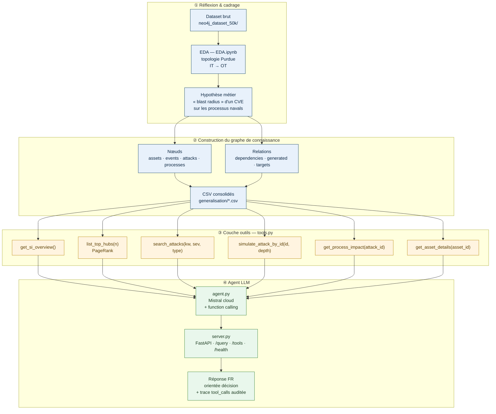
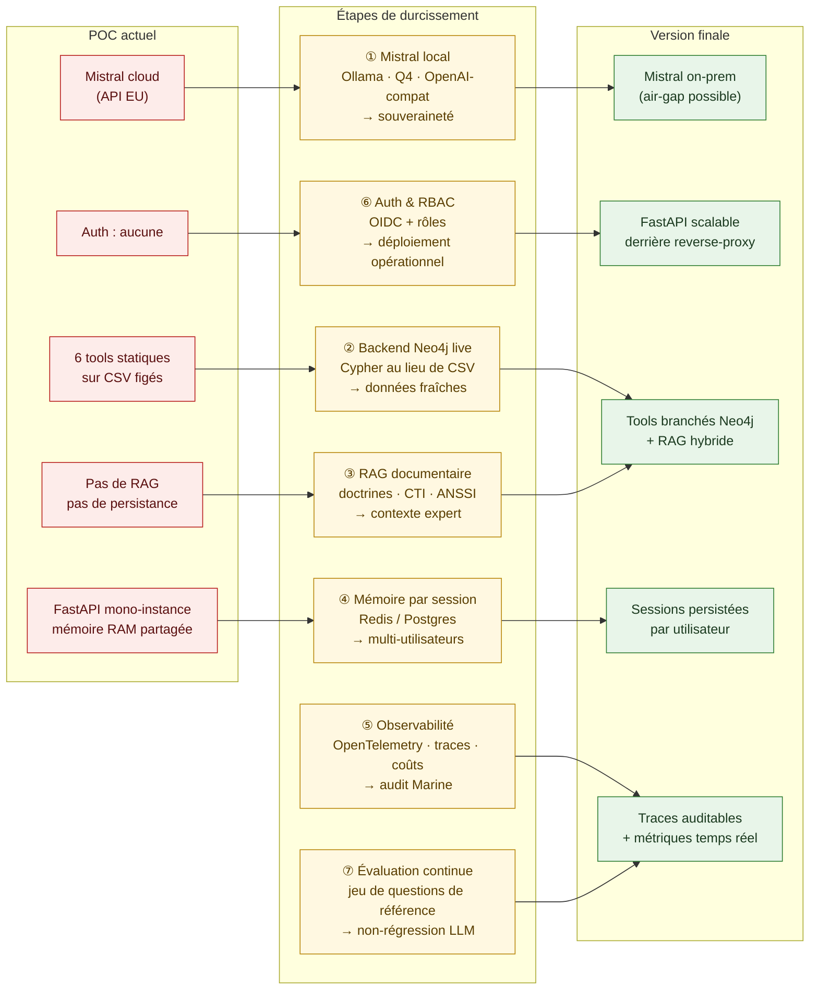

# 📊 Diagrammes — Démarche projet

Deux schémas Mermaid retraçant (1) la première session de travail — du dataset brut à l'agent POC — et (2) la trajectoire de migration du POC vers la version finale.

> GitHub rend Mermaid nativement dans les fichiers `.md`. Les blocs ci-dessous sont donc directement visibles sur la page du repo.

---

## 1. Session de réflexion — du graphe aux outils, jusqu'à l'agent

**Lecture rapide**

1. L'**EDA** dégage le motif d'attaque IT → OT et oriente le besoin métier.
2. Le **graphe** est consolidé en CSV (nœuds + relations) — source de vérité unique.
3. La couche **`tools.py`** expose des fonctions déterministes calculées sur les CSV : le LLM ne touche jamais aux DataFrames.
4. L'**agent** (Mistral + function calling) orchestre les outils, restitue en français, et trace chaque appel pour audit.

---

## 2. Du POC à la version finale

**Ce que chaque étape débloque**

| # | Étape | Gain principal |
|---|---|---|
| ① | Mistral local (Ollama) | Souveraineté, zéro fuite réseau, latence maîtrisée |
| ② | Backend Neo4j live | Le graphe évolue, les outils suivent en Cypher |
| ③ | RAG documentaire | L'agent cite des doctrines / CTI réels, pas seulement des chiffres |
| ④ | Mémoire par session | Plusieurs analystes travaillent en parallèle sans collisions |
| ⑤ | Observabilité | Coût/latence/qualité mesurés en continu |
| ⑥ | Auth & RBAC | Déploiement réaliste sur SI Marine |
| ⑦ | Évaluation continue | Détection immédiate de régression sur changement de modèle |

> L'architecture du POC est volontairement modulaire : chaque étape touche **une seule couche** (client LLM, source de données, orchestration, etc.) sans réécrire l'ensemble.
